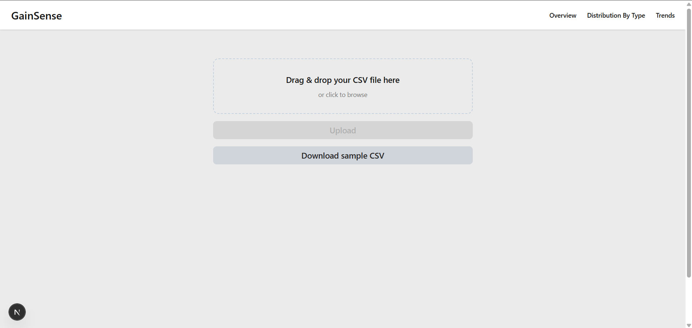
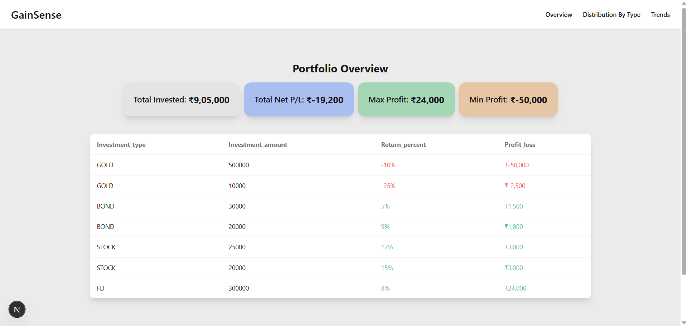
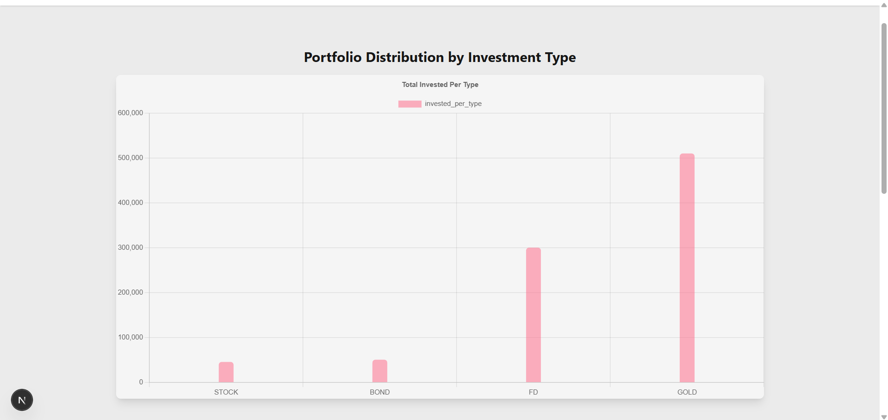
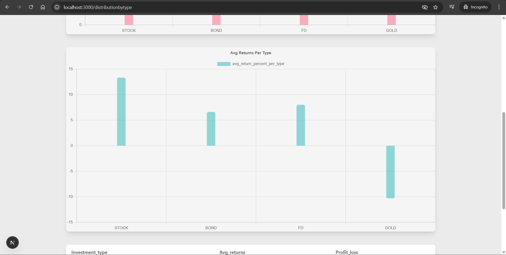
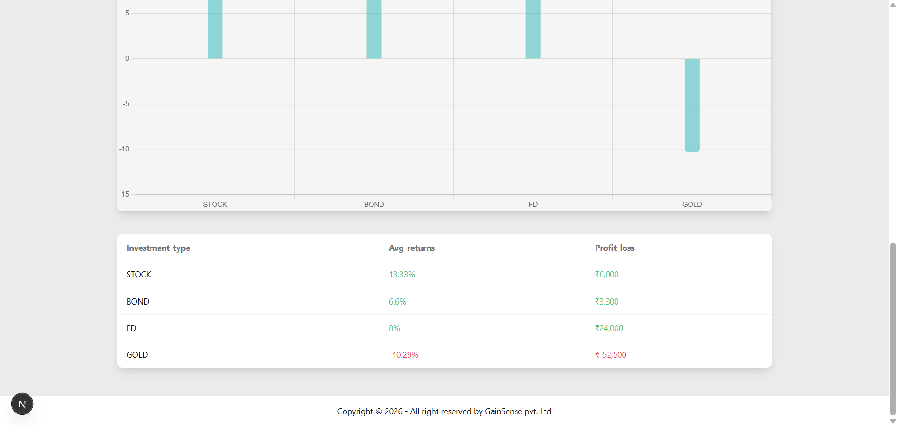
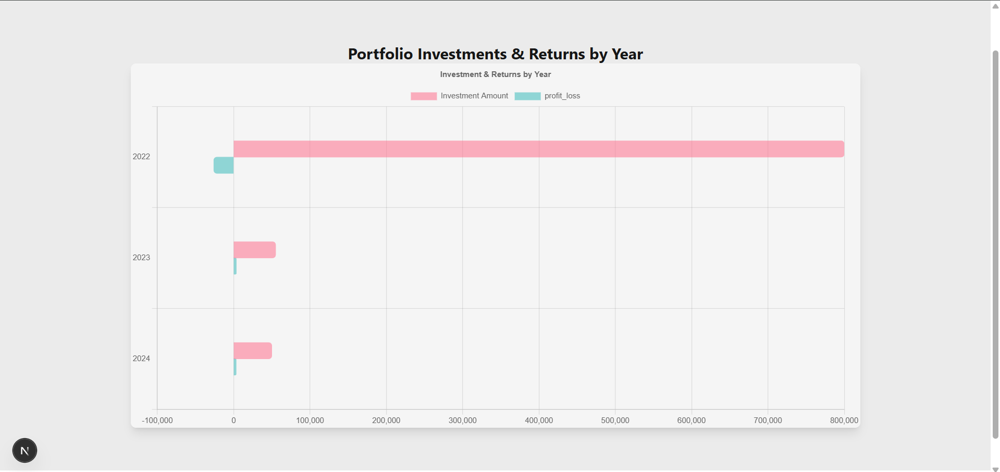

# Gainsense
GainSense is an investment analytics platform that allows users to upload CSV-based investment data and visualize yearly investment totals, profit/loss, and asset-wise distributions.
The project emphasizes backend data processing, analytics, and frontend visualization using FastAPI, PostgreSQL, and Next.js.

# Working Features
- Upload investment data via CSV
- Investment categorization (Stocks, Mutual Funds, Gold, etc.)
- Profit/Loss calculation per investment
- Aggregated metrics:Total invested amount, Net profit/loss, Best & worst performing investments
- year-wise investment and profit/loss analysis
- Distribution of investments by type
- Interactive charts & tables
- Backend data validation & error handling

# Planned Features
- Token-based data editing & viewing limits
- Advanced filters (date range, asset type)
- Export analytics as PDF/CSV
- Reading Multiple Sheets

# Tech Stack
- Frontend: Next.js(React), Tailwind CSS / Daisyui
- charts: Chart.js
- Backend: FastAPI, SQLAlchemy
- Database: PostgreSQL (Local), Supabase (Hosted PostgreSQL)

# Installation & Local Setup
- Clone the Repository: git clone https://github.com/shiv-sk/Gainsense.git
- cd Gainsense

# Install Dependencies
### Server Dependencies
- cd server
- pip install -r requirements.txt

### Client Dependencies
- cd ../client
- npm install
# Environment Variables Setup
- Set up client environment variables using env.example
- Set up server environment variables using env.example
- Ensure Postgres is running locally or use a cloud Postgres URI

# Run the Application

### Start Backend Server
- cd server
- uvicorn main:app --reload

### Start Frontend
- cd client
- npm run dev

### Sample csv
[Download sample CSV](client/public/GainSense-sample-data.csv)

**CSV Format**

```csv
investment_type,investment_amount,investment_date,return_percent
Stock,5000,2022-03-15,12
Mutual Fund,10000,2023-06-10,8
Gold,7000,2024-01-05,10 
```
**Location**
``` client/public/GainSense-sample-data.csv ```

# Screenshots






# Demo
coming soon
# Links
coming soon
# Contact
- email: shivanandcrew034@gmail.com